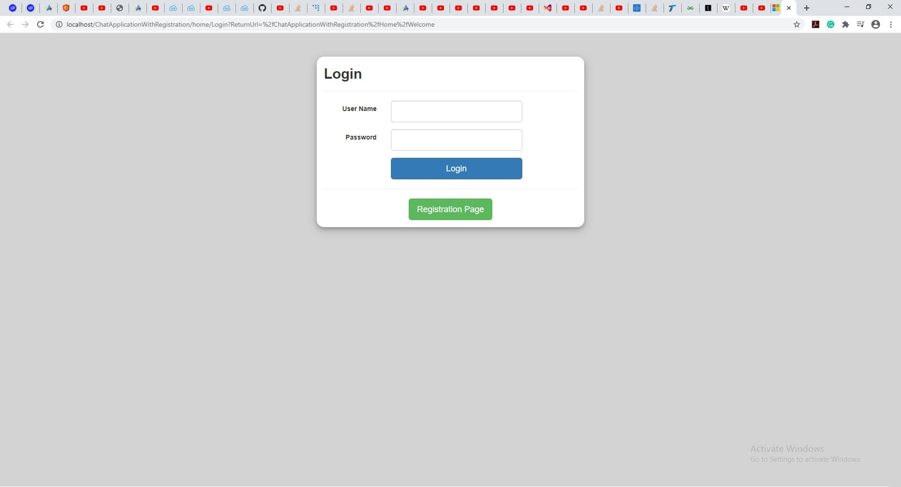
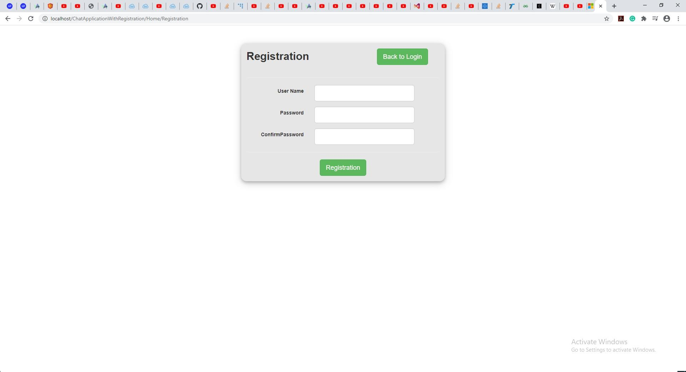
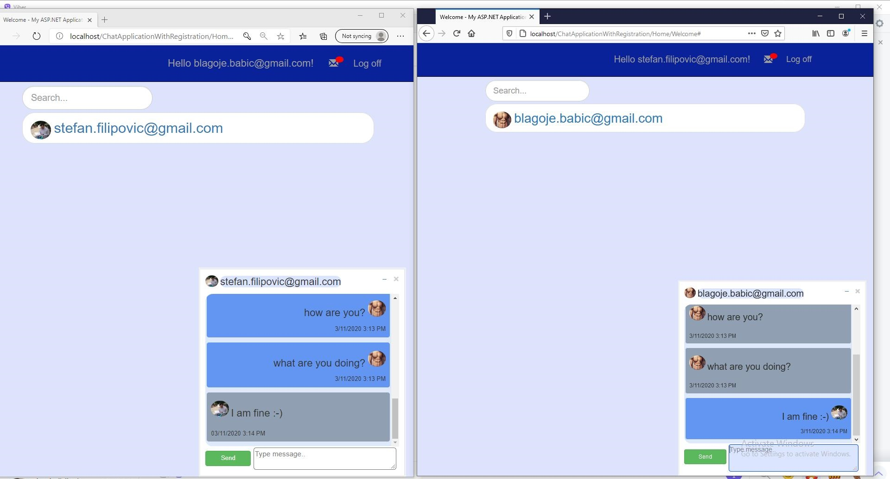
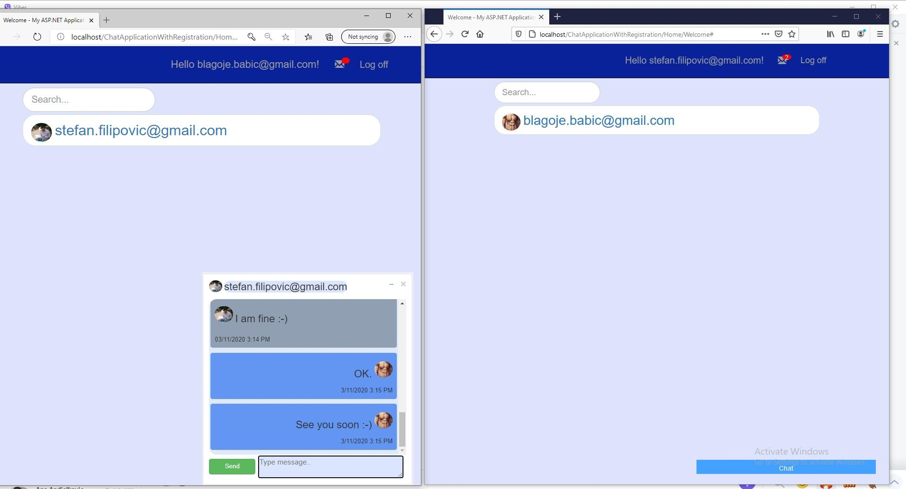
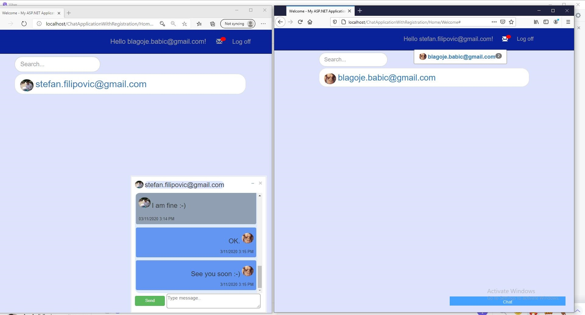
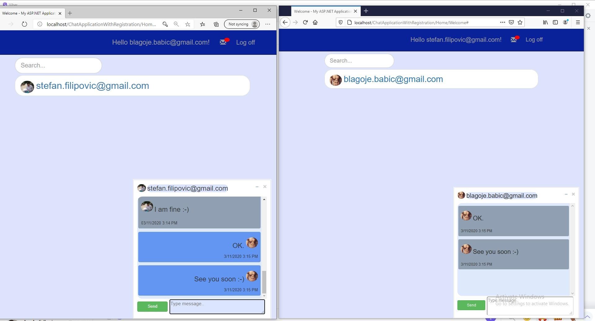

# Chat Application - ASP.NET MVC, SignalR, Bootstrap, JavaScript, jQuery, SQL 

**About this app:** MySchnitzel Union is a platform where customers can find coupons and collect loyalty points to be redeemed at participating restaurants. With this app you can order food directly from the store nearest to you. After you log-in with the credentials and select the store from the list, you are redirected to shop pages and you can make an order. Push notifications are being used to notify the user when the bill is generated. Store manager can also send notification about new coupons and promotions via push notification using Google Firebase. Users get reward points with every purchase in the restaurant. Users can also share the application with other users and get additional reward points based on that. 

## Application screenshots

###### Login Page

**Login page:**

**Registration page:**

**Chat application:**

**Notifications (look at the upper right corner):**

